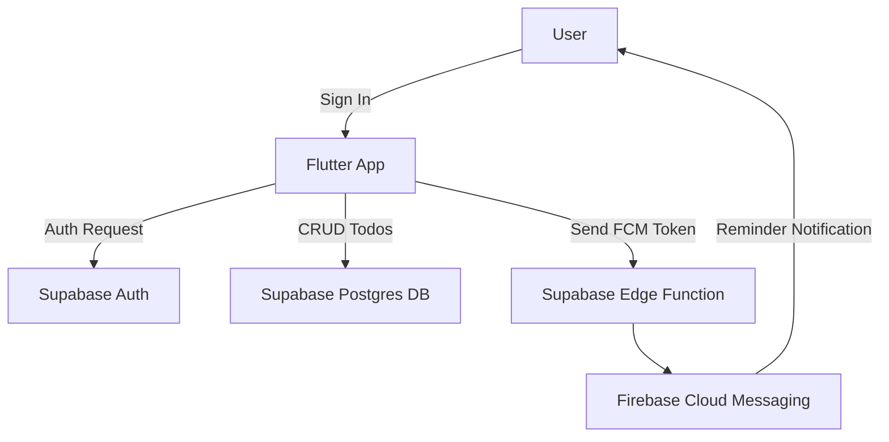

# Todo Reminder App


A simple yet powerful **Todo Reminder application** built as part of an internship assignment. It enables users to manage daily tasks through a clean interface, secure authentication, and a reliable serverless backend.

---

## Features

- **Google Authentication** – Secure sign-in with Google using Supabase Auth.  
- **User Profiles** – Displays the user’s name and profile picture for a personalized experience.  
- **Task Management** – Full create, read, update, and delete functionality for todos.  
- **Push Notifications** – Server-triggered reminders sent via Firebase Cloud Messaging one hour before a deadline, powered by Supabase Edge Functions.  
- **User-Friendly Design** – A polished, responsive UI with smooth interactions and dialogs.  

---

## Technology Stack

- **Frontend**: Flutter  
- **Backend**: Supabase (Auth, Postgres, Edge Functions)  
- **Notifications**: Firebase Cloud Messaging (FCM)  
- **State Management**: Riverpod  

---

## System Architecture



---

## Setup Instructions

### 1. Clone and Configure Environment
Clone this repository.  

Create a `.env` file in the root directory.  

Copy the following template into `.env`:  

```bash
# Supabase Config (from your Supabase Project Settings > API)
SUPABASE_URL=YOUR_SUPABASE_URL
SUPABASE_ANON_KEY=YOUR_SUPABASE_ANON_KEY

# Google OAuth Web Client ID (from Google Cloud Console > Credentials)
GOOGLE_WEB_CLIENT_ID=YOUR_GOOGLE_WEB_CLIENT_ID.apps.googleusercontent.com
```

---

### 2. Firebase / Google Cloud Setup
- Create a project in the Firebase Console.  
- Enable the **Firebase Cloud Messaging API**.  
- Create OAuth 2.0 Client IDs:  
  - **Web Client ID** → Use for `GOOGLE_WEB_CLIENT_ID` in `.env`.  
  - **Android Client ID** → Requires adding your SHA-1 fingerprint (via `./gradlew signingReport`).  

---

### 3. Supabase Setup
- Create a Supabase project.  
- Use the SQL Editor to create `todos` and `profiles` tables with appropriate RLS policies.  
- Enable Google as an authentication provider and configure client IDs.  
- Add your Supabase URL and anon key to `.env`.  

---

### 4. Run the Flutter App

```bash
flutter pub get
flutter run
```

---

### 5. Edge Function for Notifications
1. In Firebase, generate a service account key (`.json`).  
2. In Supabase Dashboard → Edge Functions → Secrets, create a secret named `FIREBASE_SERVICE_ACCOUNT` with the JSON content.  
3. Deploy the function:  

```bash
npx supabase functions deploy send-reminders --no-verify-jwt
```

4. Schedule the function using `cron.schedule` in Supabase SQL Editor.  

---

## Push Notification Status

The app is fully designed to use a Supabase Edge Function for reliable, server-triggered push notifications. The Flutter client correctly stores FCM tokens, and the server-side function is implemented.  

**Current Issue**: During final testing, the Edge Function encountered a persistent `unauthorized_client` error from Google’s authentication servers. This remains unresolved despite verifying credentials, enabling FCM APIs, and assigning the service account proper IAM roles.  

The implementation reflects the correct architecture, but further project-level configuration in Google Cloud is required.  
